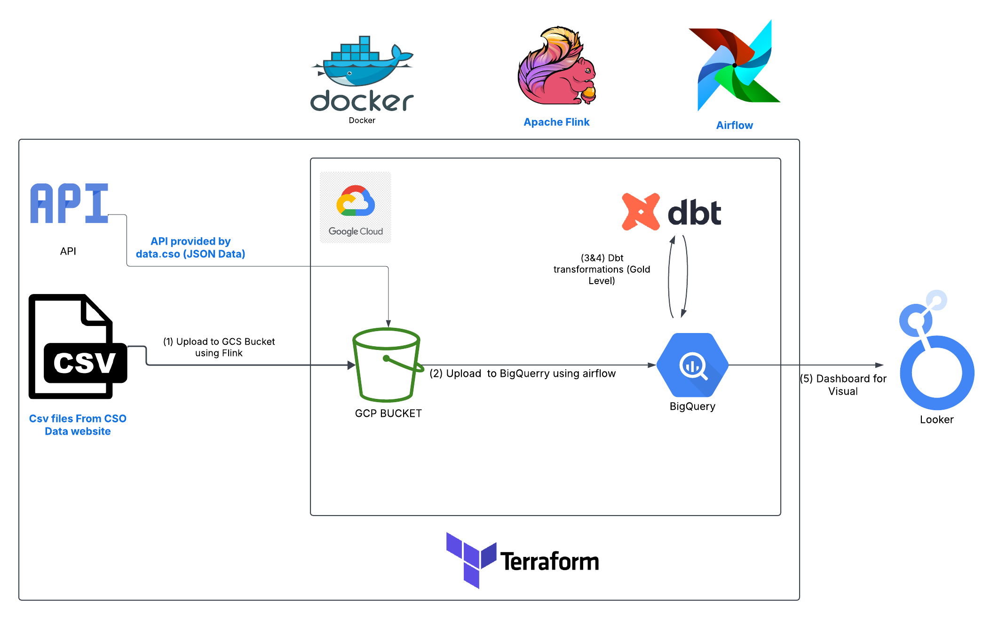
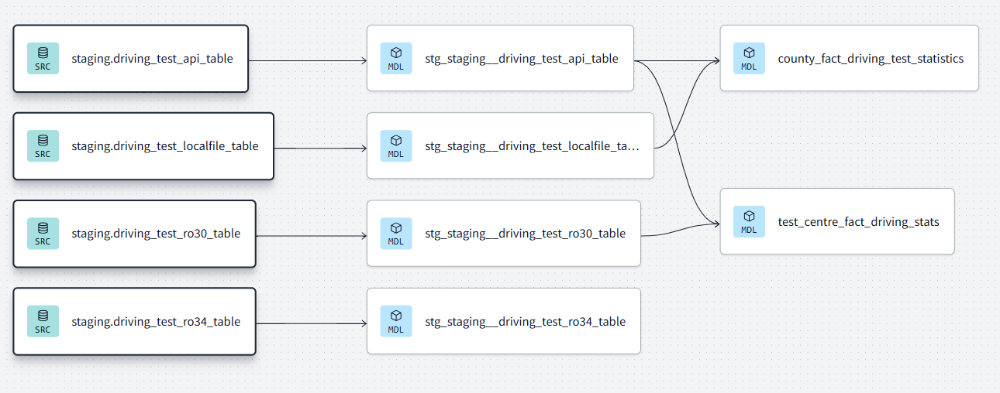
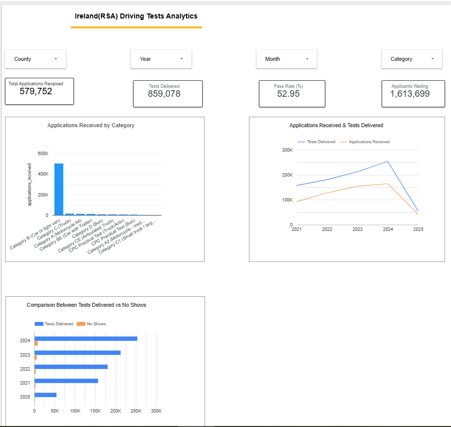
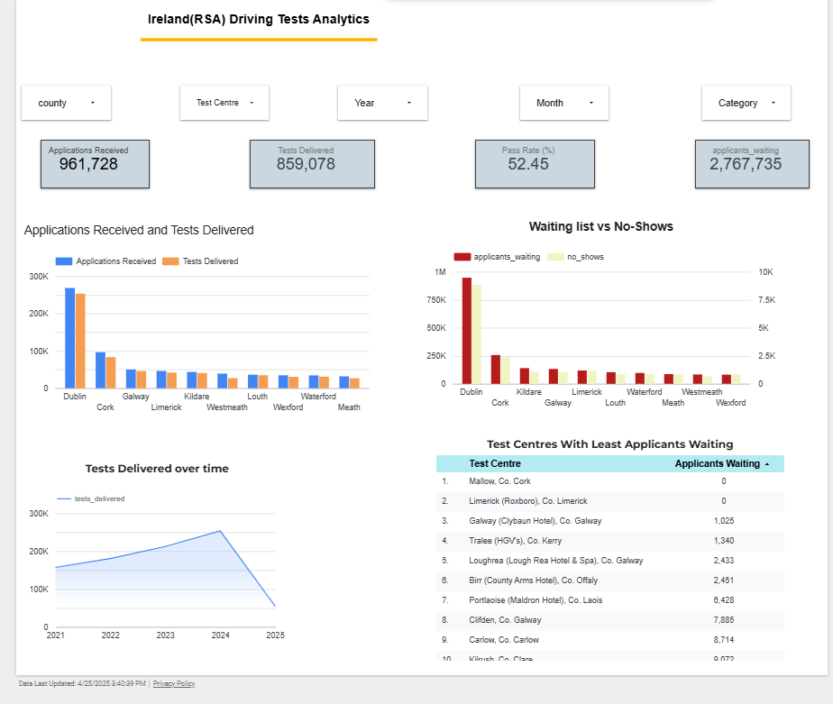

# RSA Driving Tests Analytics Dashboard

## Project Description

This project aims to extract, transform, and load (ELT) data related to the RSA driving tests in Ireland. The data is sourced from the CSO government website, using both an API and CSV files. The primary goal is to provide a comprehensive dashboard that gives users insights into the driving test process, especially helping them find available slots for booking. The dashboard can be used to monitor trends and identify the areas with the most demand for driving tests.

## Tech Stack

- **Terraform** - For creating cloud resources (GCP Bucket, BigQuery)
- **Make** - For running Docker commands and managing the pipeline
- **Docker** - Containerization for Airflow, Flink, and other components
- **Flink** - For data ingestion tasks (fetching data from an API and local files)
- **Airflow** - Orchestrating the ETL pipeline and managing workflows
- **Redpanda** - Event streaming (optional depending on implementation)
- **dbt** - Data transformation and model creation for staging and facts tables
- **BigQuery** - For storing and querying the processed data
- **Looker Studio** - For dashboard visualization of test statistics

## Folder Structure

```
├── Dockerfile.airflow
├── Dockerfile.flink
├── Makefile
├── README.md
├── dags
│   ├── flinkjob_to_gcs
│   │   ├── from_api_gcs.py
│   │   ├── from_api_r030_gcs.py
│   │   ├── from_api_r034_gcs.py
│   │   └── local_file_gcs.py
│   └── gcs_to_bigquery
│       ├── api_data_to_bq.py
│       ├── api_r034_to_bq.py
│       ├── api_ro30_to_bq.py
│       └── local_file_to_bq.py
├── data
│   ├── RAO31.csv
│   └── driving_test_20250410_054911.csv
├── dbt
│   ├── README.md
│   ├── analyses
│   ├── dbt_project.yml
│   ├── macros
│   ├── models
│   │   ├── core
│   │   │   ├── county_fact_driving_test_statistics.sql
│   │   │   ├── fact_driving_test_statistics.sql
│   │   │   ├── schema.yml
│   │   │   └── test_centre_fact_driving_stats.sql
│   │   └── staging
│   │       ├── schema.yml
│   │       ├── stg_staging__driving_test_api_table.sql
│   │       ├── stg_staging__driving_test_localfile_table.sql
│   │       ├── stg_staging__driving_test_ro30_table.sql
│   │       └── stg_staging__driving_test_ro34_table.sql
│   ├── snapshots
│   └── tests
├── docker-compose.yml
├── docker-entrypoint-fix.sh
├── fix_permissions.sh
├── install_programs.sh
├── keys
```

## Setup Instructions

### 1. Terraform Setup
Run Terraform to create the necessary resources on GCP (e.g., the GCS Bucket and BigQuery):

```bash
terraform init
terraform apply
```

### 2. Docker Setup
Use Make to manage the Docker containers:

```bash
make up  # Start the Docker containers for Airflow and Flink
make down  # Stop the containers
```

### 3. Running the DAGs
Once Airflow is up, you can trigger the DAGs to run the Flink jobs and transfer data to BigQuery.

#### Flink Jobs
- These jobs ingest data either from the CSO API or local CSV files into the GCS bucket.

#### BigQuery Transfer Jobs
- Airflow DAGs move data from the GCS bucket into BigQuery.

You can run the commands directly from Makefile:

```bash
make job  # Run the job to fetch data
make api_job  # Run the job specifically for the API data
```

## Execution Flow


The ELT pipeline follows this structure:

1. **Extract**: Flink jobs fetch data from the CSO API or local files and upload it to the GCS bucket.
2. **Load**: Airflow DAGs move the data from GCS to BigQuery.
3. **Transform**: dbt models clean and transform the data, creating staging and fact tables for analysis.



## dbt Model Breakdown

The dbt models include staging and core tables for both county-level and test centre-level analysis.

### Staging Models
- `stg_staging__driving_test_api_table.sql`
- `stg_staging__driving_test_localfile_table.sql`
- `stg_staging__driving_test_ro30_table.sql`
- `stg_staging__driving_test_ro34_table.sql`

### Core Models
- `county_fact_driving_test_statistics.sql` - Fact table for county-level statistics.
- `test_centre_fact_driving_stats.sql` - Fact table for test centre-level statistics.

Schema and test configurations are also defined for each table in the `schema.yml` files.


## Looker Studio Dashboard

### County Level Tab
- **Filters**: County, Year, Month, Test Category
- **Scorecards**: Test Delivered, Applications Received, Pass Rate
- **Graphs**:
  - Bar graph: Applications received by category.
  - Line graph: Applications received vs. tests delivered.
  - Horizontal bar: Tests delivered vs. no-shows.

### Test Centre Level Tab
- **Filters**: County, Test Centre, Year, Month, Test Category
- **Scorecards**: Test Delivered, Applications Received, Pass Rate
- **Graphs**:
  - Bar graph: Applications received vs. tests delivered.
  - Line graph: Tests delivered over time.
  - Table: Top 10 test centres with the least applicants waiting.

## Future Improvements

- Incorporating real-time data updates using Redpanda.
- Adding more detailed analysis on the test preparation process.